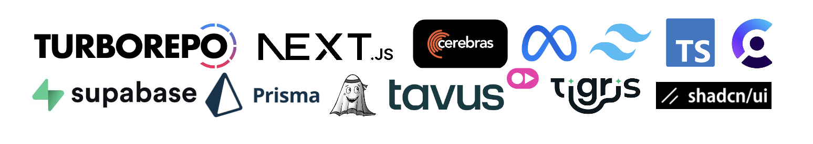
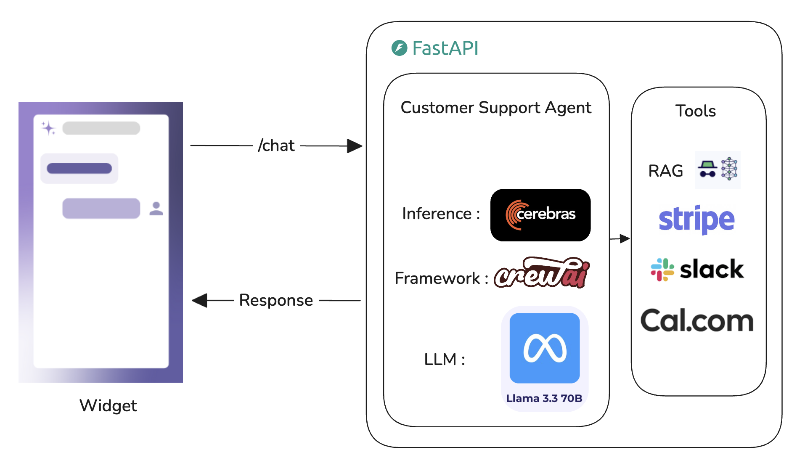
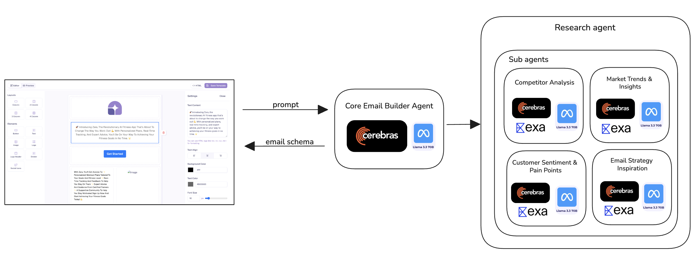
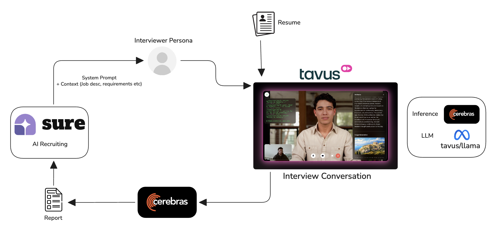

> **⚠️ Disclaimer**: In the latest commit (fix: backend url exposed), no major code changes were made. The backend URL, which was previously hardcoded and exposed in the codebase, has been moved to environment variables (`NEXT_PUBLIC_BACKEND_URL`) for better security and configuration management.

Sure AI is a comprehensive platform that empowers businesses to deploy intelligent customer support agents directly on their websites through an embeddable widget. With advanced AI capabilities, seamless integrations, and powerful management tools, Sure AI transforms customer interactions into efficient, personalized experiences.

## Demo

<div align="center">

[](https://www.youtube.com/watch?v=OwQi4XXJnPI)

</div>

## Tech Stack



- **Frontend**: Next.js, React, TypeScript
- **Backend**: Separate repository at [sure-widget-backend](https://github.com/AdithyaVardhanReddyM/sure-widget-backend) (Agents Implementation)
- **Database**: PostgreSQL with Prisma ORM
- **Authentication**: Clerk
- **Storage**: AWS S3 (Tigris)
- **AI**: Cerebras Cloud SDK, Meta, Tavus
- **UI Components**: Custom UI library with Tailwind CSS
- **State Management**: Jotai
- **Deployment**: Turbo monorepo setup
- **Secrets Management**: Doppler

## Features

### 🤖 Agent Management

- **Create and Manage Agents**: Easily create multiple AI agents tailored to different aspects of your business.
- **Document Upload & RAG**: Upload company documents and business-related files for agents to access using Retrieval-Augmented Generation (RAG) technology.
- **S3 Storage**: Securely store uploaded sources in a Tigris S3 bucket for scalable and reliable access.

### 💬 Real-Time Conversations

- **Conversations Dashboard**: Monitor all real-time conversations users have with your agents in a dedicated dashboard.
- **Live Interaction Tracking**: View ongoing chats, manage escalations, and ensure timely responses.

### 🔧 Integrations & Tools

- **Third-Party Integrations**: Seamlessly integrate with popular tools like Stripe, Slack, and Cal.com to enhance agent capabilities.
- **Customizable Interactions**: Configure agents to handle payments, scheduling, and communication workflows.

### 🎨 Customization

- **Greeting & Suggestion Messages**: Personalize the agent's initial greeting and suggested responses to align with your brand voice.
- **News & Announcements**: Optionally display news, updates, or announcements within the widget for enhanced user engagement.

### 📧 Email Marketing

- **AI-Powered Email Builder**: Craft compelling marketing emails using our advanced email_builder_agent.
- **Lead Capture & Management**: Capture and manage leads from interactions, with detailed analytics.
- **Figma-Style Editor**: Edit AI-generated email templates in a user-friendly, drag-and-drop editor.

### 🎤 AI Recruiting

- **Automated Interviews**: Powered by Tavus and Cerebras, create interviewer personas with job descriptions and ideal candidate profiles.
- **Interview Links**: Generate shareable interview links for candidates.
- **AI Reports**: Receive comprehensive AI-generated reports and inferences post-interview for data-driven hiring decisions.

## Architecture

### Widget Architecture



The embeddable widget provides a seamless chat interface for customer interactions, handling authentication, real-time messaging, and integrations.

### Email Builder Agent Architecture



Our AI-powered email builder leverages advanced language models to generate personalized, effective marketing emails.

### AI Interview Architecture



The recruiting feature uses Tavus for video interactions and Cerebras for intelligent analysis and reporting.

## Database Schema

The application uses PostgreSQL with the following key models:

- **Agent**: Core agent configuration with integration settings
- **ContactSession**: User session management for conversations
- **Conversation**: Chat threads with status tracking
- **Message**: Individual messages in conversations
- **Files**: Uploaded documents for RAG processing
- **WidgetSettings**: Customization options for the widget
- **Interview**: AI interviewer configurations
- **Candidate**: Interview participant data and reports
- **Leads**: Captured marketing leads
- **EmailTemplates**: AI-generated and edited email templates

## Installation

1. **Clone the repository**:

   ```bash
   git clone <repository-url>
   cd sure-ai
   ```

2. **Install dependencies**:

   ```bash
   pnpm install
   ```

3. **Set up environment variables**:

   Create `.env` files in the following directories with the required variables:

   **apps/web/.env**:

   ```env
   DATABASE_URL="your-postgresql-connection-string"
   NEXT_PUBLIC_CLERK_PUBLISHABLE_KEY=your-clerk-publishable-key
   CLERK_SECRET_KEY=your-clerk-secret-key
   NEXT_PUBLIC_CLERK_SIGN_IN_URL=/sign-in
   NEXT_PUBLIC_CLERK_SIGN_UP_URL=/sign-up
   NEXT_PUBLIC_CLERK_SIGN_IN_FALLBACK_REDIRECT_URL=/dashboard
   NEXT_PUBLIC_CLERK_SIGN_UP_FALLBACK_REDIRECT_URL=/dashboard
   NEXT_PUBLIC_WIDGET_APP_URL=http://localhost:3001
   NEXT_PUBLIC_AWS_ENDPOINT_URL_S3=https://your-s3-endpoint
   AWS_ACCESS_KEY_ID=your-aws-access-key
   AWS_SECRET_ACCESS_KEY=your-aws-secret-key
   AWS_ENDPOINT_URL_S3=https://your-s3-endpoint
   AWS_ENDPOINT_URL_IAM=https://your-iam-endpoint
   AWS_REGION=your-region
   S3_BUCKET_NAME=your-bucket-name
   DOPPLER_TOKEN=your-doppler-token
   NEXT_PUBLIC_TAVUS_API_KEY=your-tavus-api-key
   CEREBRAS_API_KEY=your-cerebras-api-key
   ```

   **apps/widget/.env**:

   ```env
   DATABASE_URL="your-postgresql-connection-string"
   NEXT_PUBLIC_WEB_APP_URL=http://localhost:3000
   ```

   **packages/database/.env**:

   ```env
   DATABASE_URL="your-postgresql-connection-string"
   DATABASE_PASSWORD=your-database-password
   DOPPLER_TOKEN=your-doppler-token
   ```

4. **Database setup**:

   ```bash
   cd packages/database
   pnpm db:push
   ```

5. **Run the development servers**:

   ```bash
   pnpm run dev
   ```

   This will start both the web app (port 3000) and widget app (port 3001).

6. **Build for production**:

   ```bash
   pnpm run build
   ```

## Usage

1. **Access the Web Dashboard**: Navigate to `http://localhost:3000` to manage agents, view conversations, and configure settings.

2. **Embed the Widget**: Use the provided embed code to integrate the widget into your website.

3. **Create Agents**: Set up AI agents with custom configurations, upload knowledge bases, and enable integrations.

4. **Monitor Interactions**: Use the conversations dashboard to track real-time customer interactions.

5. **Leverage Advanced Features**: Utilize email marketing tools, AI recruiting, and customization options to enhance your customer experience.

## Contributing

We welcome contributions! Please follow these steps:

1. Fork the repository
2. Create a feature branch
3. Make your changes
4. Run tests and linting
5. Submit a pull request

## License

This project is licensed under the MIT License - see the LICENSE file for details.

---

For more information about the backend architecture and API details, visit the [Sure Widget Backend](https://github.com/AdithyaVardhanReddyM/sure-widget-backend) repository.
